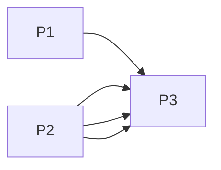

# Projects and dependencies analysis

This document provides a comprehensive overview of the projects and their dependencies in the context of upgrading to .NETCoreApp,Version=v10.0.

## Table of Contents

- [Executive Summary](#executive-Summary)
  - [Highlevel Metrics](#highlevel-metrics)
  - [Projects Compatibility](#projects-compatibility)
  - [Package Compatibility](#package-compatibility)
  - [API Compatibility](#api-compatibility)
- [Aggregate NuGet packages details](#aggregate-nuget-packages-details)
- [Top API Migration Challenges](#top-api-migration-challenges)
  - [Technologies and Features](#technologies-and-features)
  - [Most Frequent API Issues](#most-frequent-api-issues)
- [Projects Relationship Graph](#projects-relationship-graph)
- [Project Details](#project-details)

  - [MyScoreBoard/MyScoreBoard.csproj](#myscoreboardmyscoreboardcsproj)
  - [MyScoreBoardMaui/MyScoreBoardMaui.csproj](#myscoreboardmauimyscoreboardmauicsproj)
  - [MyScoreBoardShared/MyScoreBoardShared.csproj](#myscoreboardsharedmyscoreboardsharedcsproj)

## Executive Summary

### Highlevel Metrics

| Metric | Count | Status |
| :--- | :---: | :--- |
| Total Projects | 3 | All require upgrade |
| Total NuGet Packages | 8 | 4 need upgrade |
| Total Code Files | 10 |  |
| Total Code Files with Incidents | 14 |  |
| Total Lines of Code | 544 |  |
| Total Number of Issues | 107 |  |
| Estimated LOC to modify | 100+ | at least 18.4% of codebase |

### Projects Compatibility

| Project | Target Framework | Difficulty | Package Issues | API Issues | Est. LOC Impact | Description |
| :--- | :---: | :---: | :---: | :---: | :---: | :--- |
| [MyScoreBoard/MyScoreBoard.csproj](#myscoreboardmyscoreboardcsproj) | net9.0 | 🟢 Low | 2 | 3 | 3+ | AspNetCore, Sdk Style = True |
| [MyScoreBoardMaui/MyScoreBoardMaui.csproj](#myscoreboardmauimyscoreboardmauicsproj) | net9.0-android;net9.0-ios;net9.0-maccatalyst | 🟢 Low | 1 | 97 | 97+ | DotNetCoreApp, Sdk Style = True |
| [MyScoreBoardShared/MyScoreBoardShared.csproj](#myscoreboardsharedmyscoreboardsharedcsproj) | net9.0 | 🟢 Low | 1 | 0 |  | ClassLibrary, Sdk Style = True |

### Package Compatibility

| Status | Count | Percentage |
| :--- | :---: | :---: |
| ✅ Compatible | 4 | 50.0% |
| ⚠️ Incompatible | 0 | 0.0% |
| 🔄 Upgrade Recommended | 4 | 50.0% |
| ***Total NuGet Packages*** | ***8*** | ***100%*** |

### API Compatibility

| Category | Count | Impact |
| :--- | :---: | :--- |
| 🔴 Binary Incompatible | 5 | High - Require code changes |
| 🟡 Source Incompatible | 92 | Medium - Needs re-compilation and potential conflicting API error fixing |
| 🔵 Behavioral change | 3 | Low - Behavioral changes that may require testing at runtime |
| ✅ Compatible | 993 |  |
| ***Total APIs Analyzed*** | ***1093*** |  |

## Aggregate NuGet packages details

| Package | Current Version | Suggested Version | Projects | Description |
| :--- | :---: | :---: | :--- | :--- |
| Microsoft.AspNetCore.Components.Web | 9.0.6 | 10.0.1 | [MyScoreBoardShared.csproj](#myscoreboardsharedmyscoreboardsharedcsproj) | NuGet package upgrade is recommended |
| Microsoft.AspNetCore.Components.WebAssembly | 9.0.6 | 10.0.1 | [MyScoreBoard.csproj](#myscoreboardmyscoreboardcsproj) | NuGet package upgrade is recommended |
| Microsoft.AspNetCore.Components.WebAssembly.DevServer | 9.0.6 | 10.0.1 | [MyScoreBoard.csproj](#myscoreboardmyscoreboardcsproj) | NuGet package upgrade is recommended |
| Microsoft.AspNetCore.Components.WebView.Maui |  |  | [MyScoreBoardMaui.csproj](#myscoreboardmauimyscoreboardmauicsproj) | ✅Compatible |
| Microsoft.Extensions.Logging.Debug | 9.0.0 | 10.0.1 | [MyScoreBoardMaui.csproj](#myscoreboardmauimyscoreboardmauicsproj) | NuGet package upgrade is recommended |
| Microsoft.Maui.Controls |  |  | [MyScoreBoardMaui.csproj](#myscoreboardmauimyscoreboardmauicsproj) | ✅Compatible |
| sqlite-net-pcl | 1.10.196-beta |  | [MyScoreBoardMaui.csproj](#myscoreboardmauimyscoreboardmauicsproj) | ✅Compatible |
| SQLitePCLRaw.bundle_green | 2.1.11 |  | [MyScoreBoardMaui.csproj](#myscoreboardmauimyscoreboardmauicsproj) | ✅Compatible |

## Top API Migration Challenges

### Technologies and Features

| Technology | Issues | Percentage | Migration Path |
| :--- | :---: | :---: | :--- |

### Most Frequent API Issues

| API | Count | Percentage | Category |
| :--- | :---: | :---: | :--- |
| T:Microsoft.Maui.Controls.BindingMode | 20 | 20.0% | Source Incompatible |
| T:Microsoft.Maui.Storage.Preferences | 9 | 9.0% | Source Incompatible |
| P:Microsoft.Maui.Hosting.MauiAppBuilder.Services | 6 | 6.0% | Source Incompatible |
| T:Microsoft.Maui.Hosting.MauiApp | 5 | 5.0% | Source Incompatible |
| F:Microsoft.Maui.Controls.BindingMode.TwoWay | 3 | 3.0% | Source Incompatible |
| F:Microsoft.Maui.Controls.BindingMode.OneWayToSource | 3 | 3.0% | Source Incompatible |
| M:Microsoft.Maui.Storage.Preferences.Set(System.String,System.String) | 3 | 3.0% | Source Incompatible |
| M:Microsoft.Maui.Storage.Preferences.Get(System.String,System.String) | 3 | 3.0% | Source Incompatible |
| T:Microsoft.Maui.Hosting.MauiAppBuilder | 3 | 3.0% | Source Incompatible |
| T:System.Uri | 2 | 2.0% | Behavioral Change |
| F:Microsoft.Maui.Controls.BindingMode.Default | 2 | 2.0% | Source Incompatible |
| P:Microsoft.Maui.Controls.BindableProperty.DefaultBindingMode | 2 | 2.0% | Source Incompatible |
| T:Microsoft.Maui.Storage.FileSystem | 2 | 2.0% | Source Incompatible |
| P:Microsoft.Maui.Storage.FileSystem.AppDataDirectory | 2 | 2.0% | Source Incompatible |
| M:Microsoft.Maui.MauiApplication.#ctor(System.IntPtr,Android.Runtime.JniHandleOwnership) | 2 | 2.0% | Binary Incompatible |
| T:Microsoft.Maui.Controls.Xaml.Extensions | 2 | 2.0% | Source Incompatible |
| M:Microsoft.Maui.Controls.ContentPage.#ctor | 2 | 2.0% | Source Incompatible |
| T:Microsoft.Maui.Controls.Window | 2 | 2.0% | Source Incompatible |
| M:Microsoft.Maui.Controls.Application.#ctor | 2 | 2.0% | Source Incompatible |
| M:System.Uri.#ctor(System.String) | 1 | 1.0% | Behavioral Change |
| T:Microsoft.Maui.Controls.BindableProperty | 1 | 1.0% | Source Incompatible |
| M:Microsoft.Maui.Storage.Preferences.Remove(System.String) | 1 | 1.0% | Source Incompatible |
| M:Microsoft.Maui.Storage.Preferences.Set(System.String,System.Boolean) | 1 | 1.0% | Source Incompatible |
| M:Microsoft.Maui.Storage.Preferences.Get(System.String,System.Boolean) | 1 | 1.0% | Source Incompatible |
| T:Microsoft.Maui.MauiApplication | 1 | 1.0% | Binary Incompatible |
| M:Microsoft.Maui.MauiAppCompatActivity.#ctor | 1 | 1.0% | Binary Incompatible |
| T:Microsoft.Maui.MauiAppCompatActivity | 1 | 1.0% | Binary Incompatible |
| M:Microsoft.Maui.Hosting.MauiAppBuilder.Build | 1 | 1.0% | Source Incompatible |
| P:Microsoft.Maui.Hosting.MauiAppBuilder.Logging | 1 | 1.0% | Source Incompatible |
| T:Microsoft.Maui.Hosting.FontCollectionExtensions | 1 | 1.0% | Source Incompatible |
| T:Microsoft.Maui.Hosting.IFontCollection | 1 | 1.0% | Source Incompatible |
| M:Microsoft.Maui.Hosting.FontCollectionExtensions.AddFont(Microsoft.Maui.Hosting.IFontCollection,System.String,System.String) | 1 | 1.0% | Source Incompatible |
| T:Microsoft.Maui.Controls.Hosting.AppHostBuilderExtensions | 1 | 1.0% | Source Incompatible |
| M:Microsoft.Maui.Controls.Hosting.AppHostBuilderExtensions.UseMauiApp''1(Microsoft.Maui.Hosting.MauiAppBuilder) | 1 | 1.0% | Source Incompatible |
| T:Microsoft.Maui.Hosting.FontsMauiAppBuilderExtensions | 1 | 1.0% | Source Incompatible |
| M:Microsoft.Maui.Hosting.FontsMauiAppBuilderExtensions.ConfigureFonts(Microsoft.Maui.Hosting.MauiAppBuilder,System.Action{Microsoft.Maui.Hosting.IFontCollection}) | 1 | 1.0% | Source Incompatible |
| M:Microsoft.Maui.Hosting.MauiApp.CreateBuilder(System.Boolean) | 1 | 1.0% | Source Incompatible |
| T:Microsoft.Maui.Controls.NameScopeExtensions | 1 | 1.0% | Source Incompatible |
| M:Microsoft.Maui.Controls.NameScopeExtensions.FindByName''1(Microsoft.Maui.Controls.Element,System.String) | 1 | 1.0% | Source Incompatible |
| T:Microsoft.Maui.Controls.ContentPage | 1 | 1.0% | Source Incompatible |
| T:Microsoft.Maui.IActivationState | 1 | 1.0% | Source Incompatible |
| P:Microsoft.Maui.Controls.Window.Title | 1 | 1.0% | Source Incompatible |
| M:Microsoft.Maui.Controls.Window.#ctor(Microsoft.Maui.Controls.Page) | 1 | 1.0% | Source Incompatible |
| T:Microsoft.Maui.Controls.Application | 1 | 1.0% | Source Incompatible |

## Projects Relationship Graph

Legend:
📦 SDK-style project
⚙️ Classic project

## Project Details

